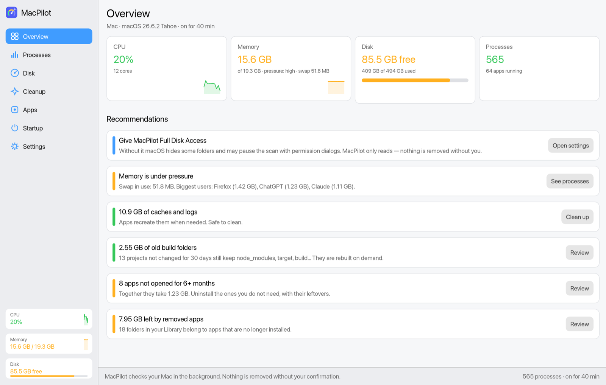
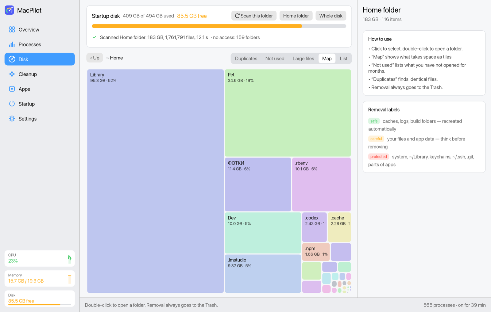
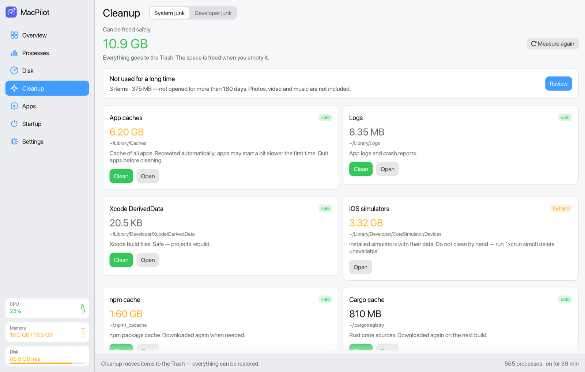
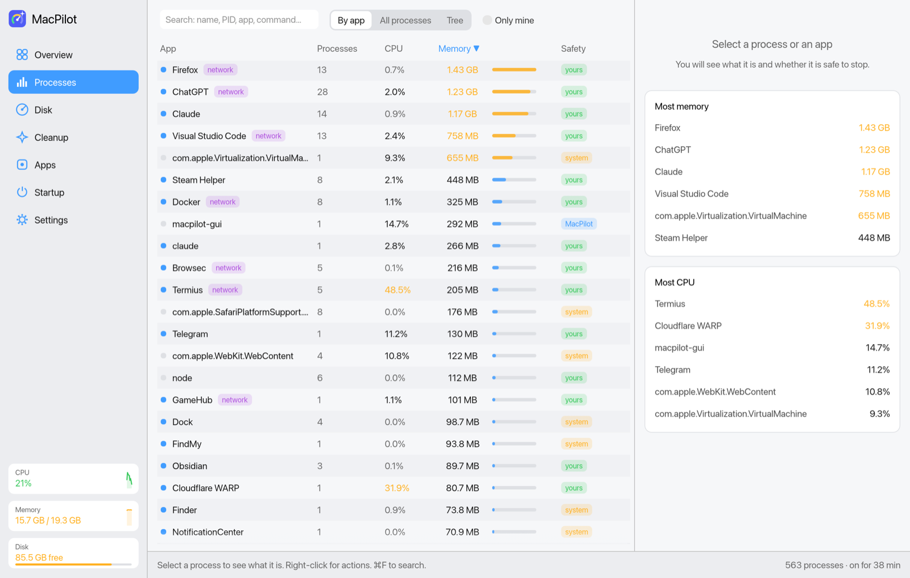
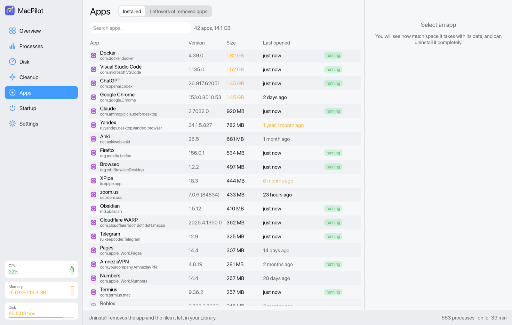

<p align="center">
  
</p>

<h1 align="center">MacPilot</h1>

<p align="center">
  A lightweight, open-source cleaner and system monitor for macOS.<br>
  See what fills your disk, clean it up safely, and keep processes, apps and startup items under control.
</p>

<p align="center">
  <b>English</b> · <a href="README.ru.md">Русский</a>
</p>

---

MacPilot brings together the most useful parts of disk analyzers, cleaners, uninstallers and activity monitors in one small native app (~9 MB), written in Rust. It explains what it finds in plain language, and **it never deletes anything permanently**: everything goes to the Trash, where Finder’s “Put Back” still works.

<p align="center">
  
</p>

<table>
  <tr>
    <td></td>
    <td></td>
  </tr>
  <tr>
    <td align="center"><sub>Disk map — what takes space</sub></td>
    <td align="center"><sub>Cleanup — caches, logs, dev junk</sub></td>
  </tr>
  <tr>
    <td></td>
    <td></td>
  </tr>
  <tr>
    <td align="center"><sub>Processes grouped by app</sub></td>
    <td align="center"><sub>Apps — size, last use, full uninstall</sub></td>
  </tr>
</table>

## Features

**Overview.** CPU, memory pressure, swap and disk at a glance, plus recommendations with one-click actions. For example: an app stuck spawning thousands of processes, known adware in your startup items, gigabytes of caches, or old build folders.

**Processes.** Group processes by app (all Chrome helpers in one row), as a flat list, or as a tree. Each process comes with an explanation of what it is (about 100 macOS services are described), whether it is safe to stop, and its open network ports. Apps quit gracefully like ⌘Q, other processes get SIGTERM. You can also force quit or pause a process. Vital macOS processes cannot be stopped at all, and system processes require you to type “yes”.

**Disk.**
- **List**: sizes, share of the folder, *Modified* and *Opened* dates.
- **Map**: a treemap, like DaisyDisk.
- **Large files**: everything from 50 MB.
- **Not used**: things you have not opened or changed for 3 months to 2 years.
- **Duplicates**: files compared by content, not by name.

**Cleanup.**
- **System junk**: app caches, logs, Xcode data, iOS updates, Mail downloads, package-manager caches (npm, pnpm, Yarn, Cargo, Gradle, Homebrew…). You can also empty the Trash from here.
- **Developer junk**: `node_modules`, `target`, `build`, `.venv`, `Pods`, DerivedData and more, in every project. It shows when each *project itself* was last changed, so builds of old projects are easy to spot.

**Apps.** Uninstall apps together with the files they leave in `~/Library`, like AppCleaner. It also finds data left behind by apps you already removed. Folders that may contain your documents are marked and never pre-selected.

**Startup.** All launch agents and daemons: what each one runs, who made it, and whether it is running. Turn items off reversibly (`launchctl disable`). Known adware and broken leftovers are flagged.

**Settings.** Language (English, Français, Español, Deutsch, Русский), appearance, open at login, and the thresholds used by the lists.

**Terminal app.** `macpilot` has a keyboard-driven terminal UI and quick reports.

## Safety rules

MacPilot is built to be hard to misuse:

- **Nothing is deleted permanently.** Removal moves items to the Trash, and you can restore them until you empty it. Emptying the Trash asks you to type “yes”.
- **Every item shows a label** (*safe*, *careful* or *protected*) and a reason.
- **Some places can never be removed:** system areas outside your home folder, `~/Library` itself, keychains, `~/.ssh`, `~/.gnupg`, Mail/Messages/Safari data, the Photos library, `.git` folders, and the inside of app bundles.
- **“Not used” never offers:**
  - photos, video or music, including folders named like “Photos”, “Camera”, “Видео”…;
  - app data, cloud folders, system and protected places;
  - single files inside developer tools. Only whole units are offered, such as an entire old Ruby version.
- **Duplicates are opt-in.** Nothing is selected until you tick a group, one copy is always kept, and copies inside git projects are marked.
- **Processes:** critical ones (launchd, WindowServer, kernel_task…) are blocked. Processes of other users need the macOS administrator prompt.

## Install

### Download

1. Get `MacPilot-<version>-macos-universal.zip` from [Releases](../../releases). It works on Apple Silicon and Intel, macOS 12 or later.
2. Unzip it and move **MacPilot.app** to **Applications**.
3. The app is not notarized, so the first time **right-click → Open**, or run:
   ```bash
   xattr -dr com.apple.quarantine /Applications/MacPilot.app
   ```

### Build from source

You need [Rust](https://rustup.rs) and the Xcode Command Line Tools (`xcode-select --install`).

```bash
git clone https://github.com/<you>/macpilot.git
cd macpilot
./install.sh
```

This installs `MacPilot.app` to `/Applications` and the `macpilot` command to `~/.local/bin`.

## First run

- **Give Full Disk Access** in System Settings → Privacy & Security → Full Disk Access → add MacPilot. Without it, macOS hides some folders and may pause the scan with permission dialogs. MacPilot shows a hint when that happens.
- When you first move something to the Trash, allow MacPilot to control **Finder**, so that “Put Back” works.
- **Open at login** is in Settings. It uses a standard LaunchAgent in `~/Library/LaunchAgents/local.macpilot.plist`.

## Terminal usage

```text
macpilot                 interactive terminal UI (processes, disk, cleanup)
macpilot disk [PATH]     open the disk analyzer
macpilot stale [DAYS]    list what has not been used for DAYS days (default 180)
macpilot junk [DAYS]     list build folders of projects untouched for DAYS days
macpilot apps            list installed apps by size and last use
macpilot leftovers       list leftovers of removed apps
macpilot startup         list startup items
macpilot dupes [PATH]    find duplicate files
macpilot --lang fr       any command in another language (en, fr, es, de, ru)
```

Keys also work with the Russian keyboard layout.

## How it works

- **Sizes** are the space actually used on disk, like Finder’s “on disk”. Hard links are counted once, and APFS firmlinks and other volumes are skipped.
- **“Opened”** is the later of the last read and the last modification of a file. For a folder, it is the latest of everything inside it.
- **App “last opened”** comes from Spotlight, or from the executable’s last read.
- **Duplicates** are found by comparing, in turn: file size, a hash of the first and last 64 KB, and a full-content hash.
- **Background work** runs on its own low-priority thread pools. Reading other apps’ sandbox containers has a timeout, so a pending macOS privacy decision cannot hang the scan.

## Development

```bash
cargo run --bin macpilot-gui          # window app
cargo run --bin macpilot              # terminal app
cargo test                            # unit tests (safety rules, translations, parsers…)
cargo clippy --all-targets -- -D warnings
scripts/bundle.sh [--dist|--universal]  # build dist/MacPilot.app
```

The project is one Rust crate:

| Path | What |
|---|---|
| `src/lib.rs` + modules | core: `disk` (scan and safety rules), `procs`, `clean`, `devjunk`, `dupes`, `apps`, `startup`, `trash`, `i18n`, `settings` |
| `src/gui/` | window app (egui) |
| `src/main.rs`, `src/app.rs`, `src/ui.rs` | terminal app (ratatui) |
| `src/i18n/strings.rs` | translations |

Build only what you need: `cargo build --release --no-default-features --features gui` (window app) or `--features tui` (terminal app). Everyday builds use thin LTO. Release builds use `--profile dist`.

See [CONTRIBUTING.md](CONTRIBUTING.md) for how to add a language or a cleanup rule.

## License

[MIT](LICENSE)
