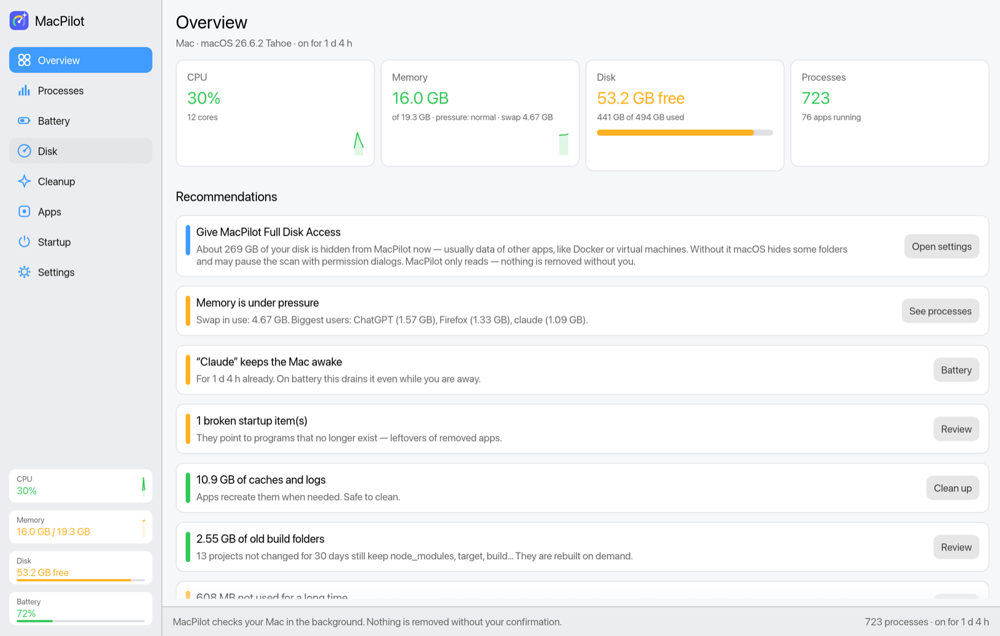
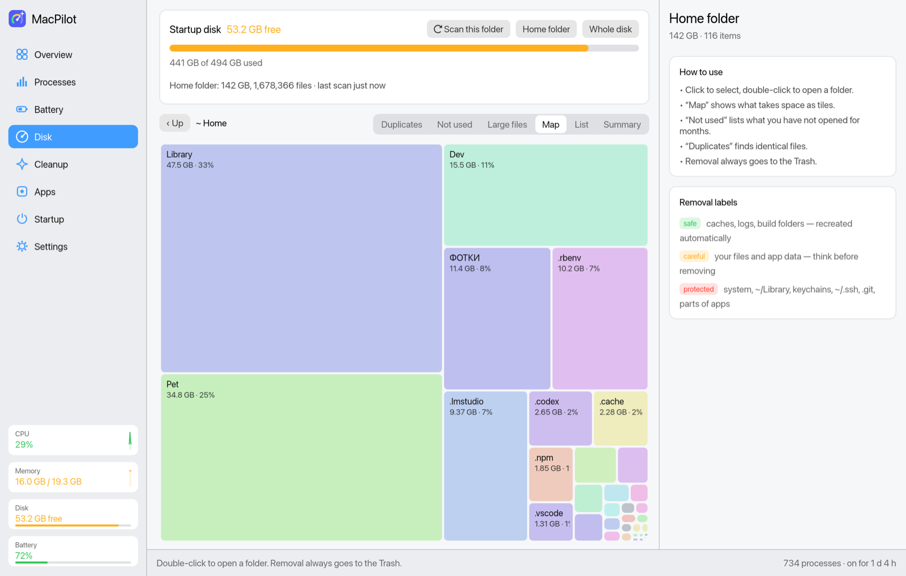
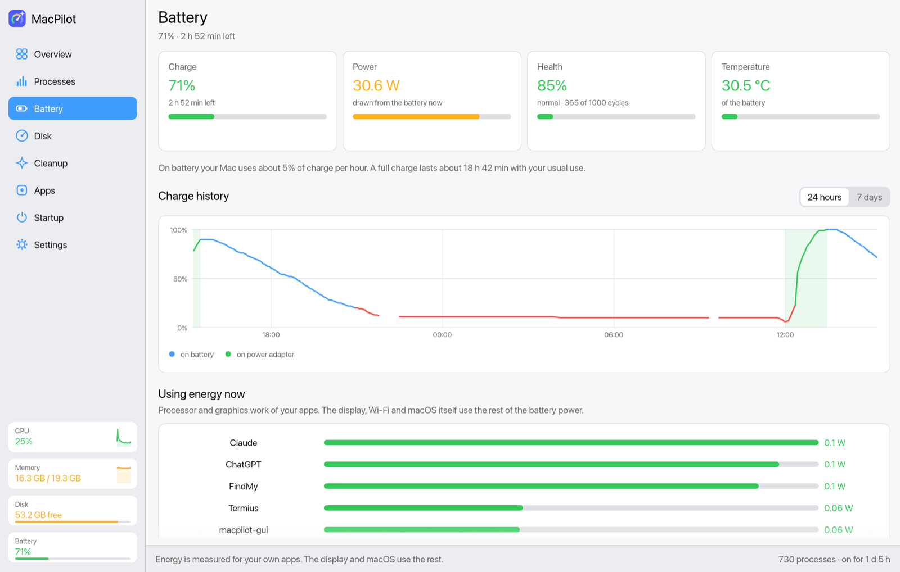
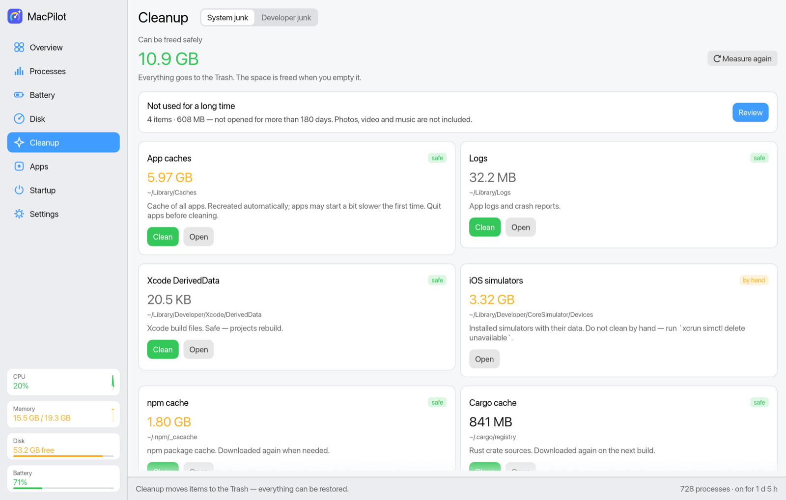
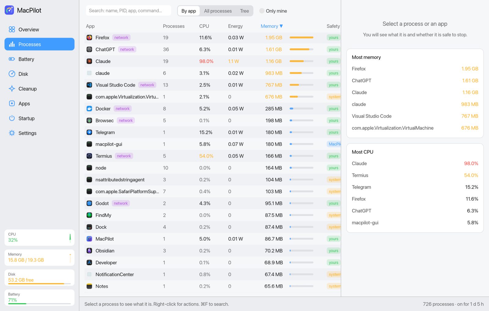
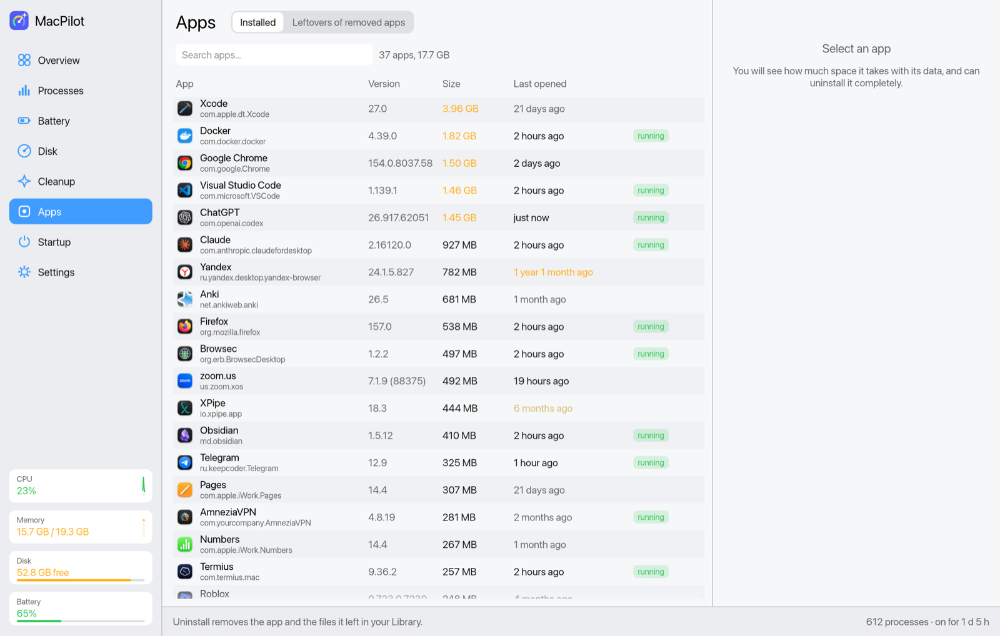
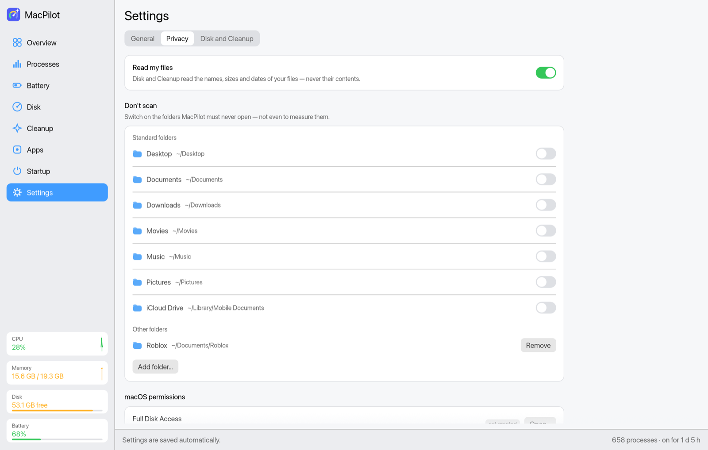

<p align="center">
  
</p>

<h1 align="center">MacPilot</h1>

<p align="center">
  Лёгкий бесплатный очиститель и системный монитор для macOS.<br>
  Показывает, чем забит диск, безопасно чистит его и держит под контролем процессы, приложения и автозагрузку.
</p>

<p align="center">
  <a href="README.md">English</a> · <b>Русский</b>
</p>

---

MacPilot собирает в одном маленьком нативном приложении (около 9 MB, написано на Rust) самое полезное из анализаторов диска, чистильщиков, деинсталляторов и мониторов активности. Он простыми словами объясняет, что нашёл, и **никогда ничего не удаляет навсегда**: всё уходит в Корзину, откуда работает «Вернуть» в Finder.

<p align="center">
  <picture><source media="(prefers-color-scheme: dark)" srcset="docs/screenshots/overview_dark.png"></picture>
</p>

<table>
  <tr>
    <td><picture><source media="(prefers-color-scheme: dark)" srcset="docs/screenshots/disk_map_dark.png"></picture></td>
    <td><picture><source media="(prefers-color-scheme: dark)" srcset="docs/screenshots/battery_dark.png"></picture></td>
  </tr>
  <tr>
    <td align="center"><sub>Карта диска — что занимает место</sub></td>
    <td align="center"><sub>Батарея — здоровье, история, расход</sub></td>
  </tr>
  <tr>
    <td><picture><source media="(prefers-color-scheme: dark)" srcset="docs/screenshots/clean_dark.png"></picture></td>
    <td><picture><source media="(prefers-color-scheme: dark)" srcset="docs/screenshots/procs_dark.png"></picture></td>
  </tr>
  <tr>
    <td align="center"><sub>Очистка — кэши, логи, мусор разработчика</sub></td>
    <td align="center"><sub>Процессы по приложениям</sub></td>
  </tr>
  <tr>
    <td><picture><source media="(prefers-color-scheme: dark)" srcset="docs/screenshots/apps_dark.png"></picture></td>
    <td><picture><source media="(prefers-color-scheme: dark)" srcset="docs/screenshots/privacy_dark.png"></picture></td>
  </tr>
  <tr>
    <td align="center"><sub>Приложения — размер, последний запуск, полное удаление</sub></td>
    <td align="center"><sub>Конфиденциальность — папки, которые MacPilot не открывает</sub></td>
  </tr>
</table>

## Возможности

**Обзор.** CPU, нагрузка на память, своп и диск на одном экране, плюс рекомендации с кнопками. Например: приложение, которое зациклилось и наплодило тысячи процессов, навязчивое ПО в автозагрузке, гигабайты кэшей, старые папки сборки.

**Процессы.** Группировка по приложениям (все helper'ы Chrome в одной строке), общий список или дерево. Для каждого процесса видно, что это такое (описано около 100 служб macOS), можно ли его останавливать и какие порты он слушает. Приложения закрываются мягко, как по ⌘Q, остальные процессы получают SIGTERM. Можно также завершить принудительно или поставить на паузу. Критичные процессы macOS остановить нельзя, для системных нужно ввести «да».

**Батарея.** Заряд, сколько осталось и сколько ватт тратится прямо сейчас; здоровье и циклы — как в Системных настройках; температура; история заряда за 24 часа и 7 дней и средний расход в час. Показывает, какие приложения сейчас тратят энергию (в ваттах) и что не даёт Mac уснуть, и предупреждает, если батарее нужно обслуживание или она перегревается. На странице «Процессы» тоже есть колонка «Энергия».

**Диск.**
- **Сводка**: весь диск одной полосой (твои файлы, приложения и другие папки, macOS, подкачка, свободное место и то, что скрыто без полного доступа), а также что выросло или уменьшилось за день, неделю или месяц.
- **Список**: размеры, доля в папке, даты «Изменён» и «Открывался».
- **Карта**: плитки по размеру, как в DaisyDisk.
- **Крупные файлы**: всё от 50 MB.
- **Давно не нужны**: то, что не открывали и не меняли от 3 месяцев до 2 лет.
- **Дубликаты**: сравнение по содержимому, а не по имени.

**Очистка.**
- **Системный мусор**: кэши приложений, журналы, данные Xcode, прошивки iOS, загрузки Почты, кэши менеджеров пакетов (npm, pnpm, Yarn, Cargo, Gradle, Homebrew…). Отсюда же можно очистить Корзину.
- **Мусор разработчика**: `node_modules`, `target`, `build`, `.venv`, `Pods`, DerivedData и другие, во всех проектах. Видно, когда менялся **сам проект**, поэтому сборки старых проектов легко найти.

**Приложения.** Удаление вместе с файлами в `~/Library`, как в AppCleaner. Также находятся хвосты уже удалённых приложений — в Application Support, Caches, Containers, Preferences, Logs, WebKit, cookies и других местах, по идентификатору и по имени приложения — и группируются по приложению. Данные Apple, помощники установленных приложений и общие обновляторы не попадают в список; контейнеры, где могут лежать твои документы, помечены.

**Автозагрузка.** Все LaunchAgents и LaunchDaemons: что запускается, кто производитель, работает ли сейчас. Отключение обратимо (`launchctl disable`). Нежелательное ПО и «сломанные» записи помечаются.

**Приложения (перетаскиванием).** Перетащи любое `.app` в окно, чтобы удалить его вместе с остатками, даже из «Загрузок» или с образа диска. Перетащи файл или папку, чтобы найти их на странице «Диск».

**Строка меню.** Процессор и память в строке меню, а в её меню — свободное место и самое прожорливое приложение. Если закрыть окно, MacPilot останется там; ⌘Q — выход.

**Быстрый старт.** Последнее сканирование домашней папки сохраняется (компактный кэш ~7 MB), поэтому данные видны сразу при запуске, а свежее сканирование идёт в фоне.

**Настройки.** Стиль (стандартный или «Классический Mac», у каждого светлая и тёмная тема), язык (English, Français, Español, Deutsch, Русский), тема, открытие при входе (обычный объект входа macOS), строка меню, проверка обновлений и пороги для списков.

**Уведомления.** Только о реальных проблемах: приложение зациклилось и плодит сотни процессов, диск почти заполнен, батарея горячая или какое-то приложение её сажает. По клику открывается нужная страница; отключаются в «Настройках».

**Обновления.** Раз в день MacPilot спрашивает у GitHub номер последней версии и показывает заметку в «Настройках». Больше ничего не отправляется, проверку можно выключить.

**Доступность.** Работает с VoiceOver.

**Терминал.** Команда `macpilot`: интерфейс с управлением клавишами и быстрые отчёты.

## Правила безопасности

- **Ничего не удаляется навсегда.** Всё уходит в Корзину, и это можно вернуть, пока она не очищена. Для очистки Корзины нужно ввести «да».
- **У каждого объекта есть метка** («можно», «осторожно» или «защищено») и объяснение.
- **Никогда не удаляются:** системные области вне домашней папки, сама `~/Library`, связки ключей, `~/.ssh`, `~/.gnupg`, данные Почты, Сообщений и Safari, медиатека «Фото», папки `.git` и внутренности пакетов приложений.
- **В «Давно не нужны» никогда не попадают:**
  - фото, видео и музыка, в том числе папки с названиями вроде «Фото», «Camera», «Видео»;
  - данные приложений, облачные папки, системные и защищённые места;
  - отдельные файлы внутри инструментов разработчика. Предлагаются только целые единицы, например целиком старая версия Ruby.
- **Дубликаты удаляются только по выбору.** Пока не отметишь группу, ничего не выбрано, одна копия всегда остаётся, а копии внутри git-проектов помечаются.
- **Процессы:** критичные (launchd, WindowServer, kernel_task…) заблокированы. Процессы других пользователей требуют системного пароля администратора.

## Установка

### Скачать

1. Возьми `MacPilot-<версия>.dmg` в [Releases](../../releases). Подходит для Apple Silicon и Intel, macOS 12 и новее.
2. Открой его и перетащи **MacPilot** в **Программы**.
3. Релизы пока не нотаризованы, поэтому при первом запуске появится окно **«MacPilot» не открыт**. Нажми **Готово**, затем открой **Системные настройки → Конфиденциальность и безопасность**, пролистай вниз и нажми **Всё равно открыть** (на macOS 14 и раньше работает и **правый клик → Открыть**). Или один раз выполни:
   ```bash
   xattr -dr com.apple.quarantine /Applications/MacPilot.app
   ```

### Homebrew

```bash
brew install --cask <you>/tap/macpilot
```

Ставит приложение и команду `macpilot` для терминала.

### Собрать из исходников

Нужны [Rust](https://rustup.rs) и Xcode Command Line Tools (`xcode-select --install`).

```bash
git clone https://github.com/<you>/macpilot.git
cd macpilot
./install.sh
```

Скрипт установит `MacPilot.app` в `/Applications`, а команду `macpilot` в `~/.local/bin`.

## Первый запуск

При первом запуске MacPilot **не читает никаких файлов**: «Процессы», «Батарея», «Приложения» и «Автозагрузка» работают сразу. «Диск» и «Очистка» сначала объясняют, что им нужно (имена, размеры и даты файлов — никогда не содержимое), и спрашивают разрешения. Любую папку — «Рабочий стол», «Загрузки», «Изображения» или любую другую — можно исключить в «Настройках → Конфиденциальность» и передумать там же в любой момент.

Разрешения спрашиваются **один раз** и запоминаются, в том числе после обновлений:

- **Выдай полный доступ к диску**: Системные настройки → Конфиденциальность и безопасность → Полный доступ к диску → добавь MacPilot. Одно это разрешение покрывает всё, других окон про файлы не будет. Без него MacPilot пропускает данные других приложений (иначе macOS спрашивала бы о них при каждом запуске) и показывает такие папки как «нет доступа».
- При первом удалении разреши MacPilot управлять **Finder**, тогда будет работать «Вернуть».
- **Открывать при входе** включается в Настройках. MacPilot появится в Системных настройках → Основные → Объекты входа, как любое приложение.

macOS запоминает разрешения по подписи приложения. Релизы подписаны. `./install.sh` подписывает локальным сертификатом, который один раз создаёт в отдельной связке ключей (`~/Library/Keychains/macpilot-signing.keychain-db`), поэтому разрешения сохраняются и после пересборки.

## Терминал

```text
macpilot                 интерфейс в терминале (процессы, диск, очистка)
macpilot disk [ПУТЬ]     анализ диска
macpilot stale [ДНЕЙ]    то, чем не пользовались ДНЕЙ дней (по умолчанию 180)
macpilot junk [ДНЕЙ]     папки сборки проектов, не менявшихся ДНЕЙ дней
macpilot apps            приложения по размеру и последнему запуску
macpilot leftovers       хвосты удалённых приложений
macpilot startup         элементы автозагрузки
macpilot battery         заряд и здоровье батареи, кто тратит энергию
macpilot dupes [ПУТЬ]    дубликаты файлов
macpilot --lang ru       любая команда на другом языке (en, fr, es, de, ru)
```

## Разработка

Смотри раздел «Development» в [README.md](README.md) и [CONTRIBUTING.md](CONTRIBUTING.md).

## Лицензия

[MIT](LICENSE)
